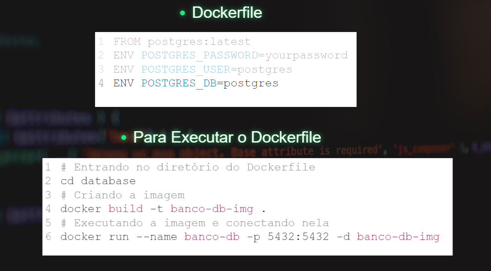
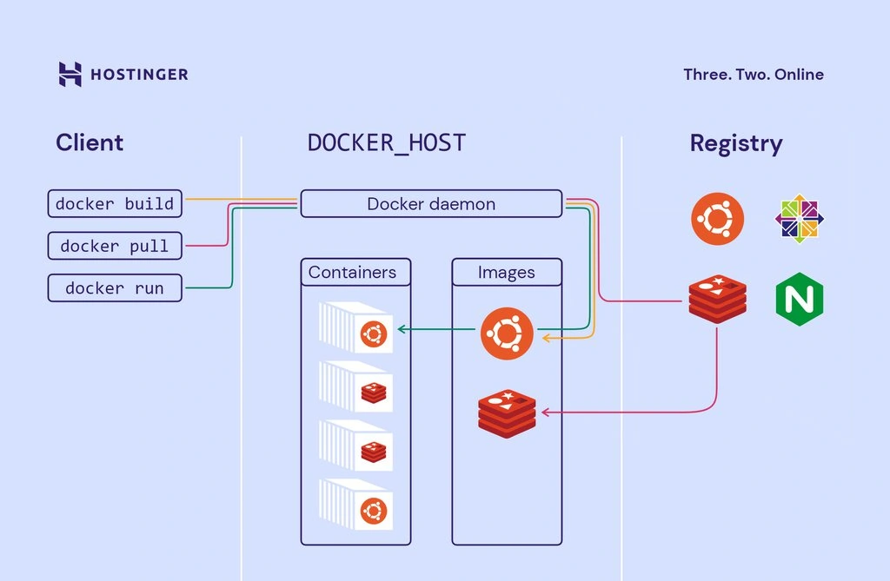
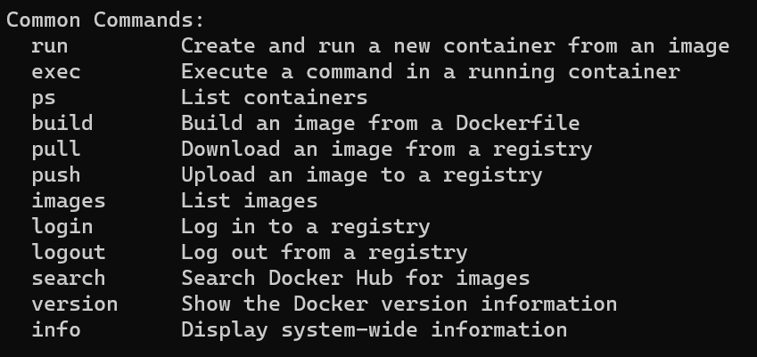
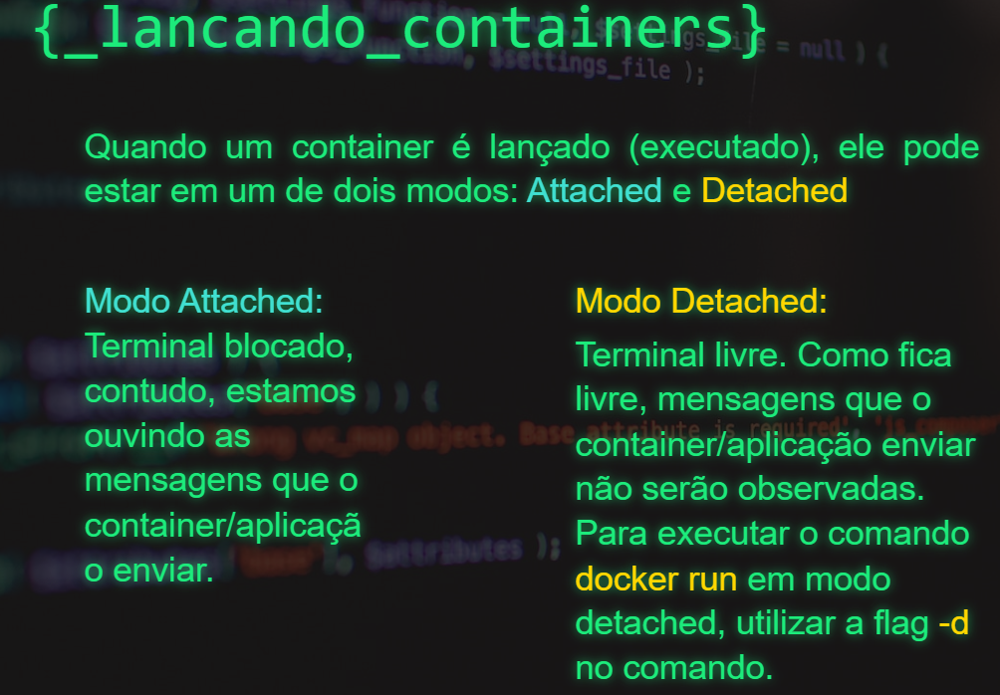
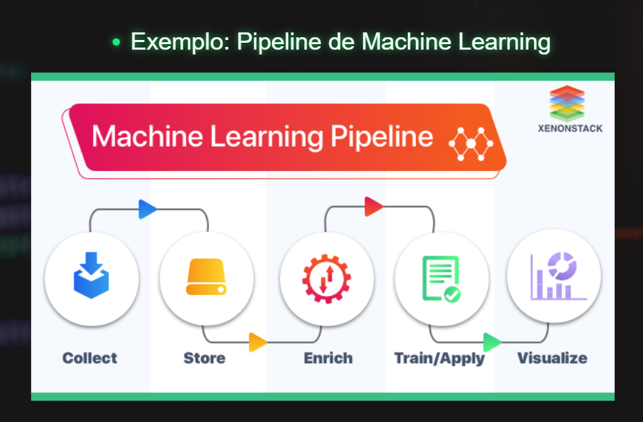
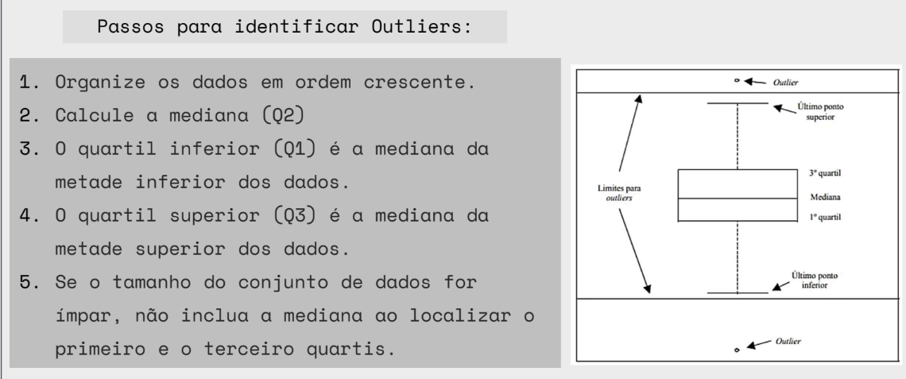

# revisas
Repositório da  revisão do módulo 7

# Programação
## Docker:

Docker é uma plataforma de código aberto que permite criar, implantar e executar aplicativos em contêineres. Um contêiner é uma unidade leve e autossuficiente que contém tudo o que é necessário para executar um software, incluindo o código, as bibliotecas, as dependências e as configurações do ambiente. Isso inclui não apenas o aplicativo em si, mas também o sistema operacional e os recursos compartilhados.

Os contêineres são isolados uns dos outros e podem ser executados consistentemente em diferentes ambientes, como desenvolvimento, teste e produção, sem problemas de compatibilidade. Isso é possível porque os contêineres aproveitam as tecnologias de isolamento do sistema operacional subjacente, como namespaces e cgroups, para garantir que cada contêiner tenha sua própria visão do sistema.

Docker oferece várias vantagens:

1. **Portabilidade:** Os contêineres são consistentes em diferentes ambientes, o que facilita a implantação e evita problemas de "funciona no meu computador".

2. **Isolamento:** Os contêineres fornecem isolamento de recursos e ambientes, garantindo que um contêiner não afete negativamente outros contêineres no mesmo sistema.

3. **Eficiência:** Como os contêineres compartilham o núcleo do sistema operacional, eles são mais leves em comparação com máquinas virtuais completas, resultando em um uso mais eficiente de recursos.

4. **Escalabilidade:** Os contêineres podem ser escalados facilmente, permitindo aumentar ou diminuir a capacidade de acordo com a demanda, o que é especialmente útil em ambientes de nuvem.

5. **Rápido provisionamento:** Os contêineres podem ser iniciados e interrompidos rapidamente, facilitando o provisionamento e a implantação de aplicativos.

6. **Gestão de versões:** A imagem do contêiner encapsula o aplicativo e suas dependências, o que facilita a gestão de versões e garante que todos os ambientes estejam usando a mesma configuração.

Em resumo, o Docker simplifica o processo de empacotar, implantar e executar aplicativos, melhorando a consistência e a eficiência em diferentes ambientes. Isso o torna uma ferramenta popular no desenvolvimento ágil, DevOps e implantação de aplicativos em ambientes de produção.

Imagine nosso software como uma mercadoria a ser transportar como por exemplo, do ambiente de Desenvolvimento para Produção.

Para fazer isso precisamos garantir que nosso ambiente de Produção tenha todos os pré-requisitos instalados, de preferência uma versão do S.O. parecida com a do ambiente de Desenvolvimento entre outros cuidados que devem ser tomados (relacionados a permissionamento, serviços dependentes e etc...).

Com o Docker temos um container com nosso software. Esse container é levado inteiro para o outro ambiente.

Um contêiner Docker é uma instância em execução de uma imagem. É uma unidade isolada e executável que contém todos os recursos necessários para executar um aplicativo. Os contêineres compartilham o mesmo kernel do sistema operacional hospedeiro, mas possuem um ambiente de arquivos isolado e recursos separados, garantindo que não interfiram uns nos outros.

Os contêineres são construídos a partir de imagens. Quando você executa uma imagem usando o comando docker run, o Docker cria um contêiner baseado nessa imagem, disponibilizando um ambiente isolado onde o aplicativo pode ser executado.

Com isso não precisamos nos preocupar com pré-requisitos instalados no outro ambiente, versão do S.O., permissionamento e se quisermos podemos ter containers para os serviços dependentes também. Dessa forma minimizamos muito a divergência entre os ambientes.


### Imagens
O Docker trabalha com o conceito de images, ou seja, para colocar um container em funcionamento o Docker precisa ter a imagem no host.

Essas imagens podem ser baixadas de um repositório (a nomenclatura para esse repositório é registry) ou criadas localmentes e compiladas. Esse é o link para o registry do Docker.

Nesse registry podemos ter imagens oficiais e não oficiais. Além de podermos criar nossas próprias imagens, também é possível fazer upload dela em um registry.

Uma imagem Docker é uma representação estática e autossuficiente de um sistema de arquivos que inclui todas as informações necessárias para executar um aplicativo ou serviço. Ela contém o código do aplicativo, bibliotecas, dependências, arquivos de configuração e até mesmo o sistema operacional base, se necessário. As imagens são criadas a partir de um conjunto de instruções definidas em um arquivo chamado Dockerfile.

O Dockerfile é um arquivo de texto que descreve passo a passo como construir a imagem. Ele pode conter comandos como copiar arquivos para a imagem, instalar pacotes, configurar variáveis de ambiente e executar outros comandos de configuração. Após criar o Dockerfile, você pode usar o comando docker build para criar a imagem.

As imagens no Docker são como as classes em POO, elas são os modelos para os containers.
Ela são construídas em camadas READ-ONLY, com uma última camada de escrita que é adicionada quando um container é lançado

### Como são feitas as imagens?
Nesse momento podemos pensar que o Docker é meio mágico (e é...kkk). Dado uma imagem ele pode rodar um ou mais containers com pouco esforço, mas como são feitas as images?

Uma imagem pode ser criada a partir de um arquivo de definição chamado de Dockerfile, nesse arquivo usamos algumas diretivas para declarar o que teremos na nossa imagem. Por exemplo se olharmos a definição da imagem do Ubuntu podemos ver algo semelhante a isso

### Docker vs Máquina Virtual
Embora o Docker e as máquinas virtuais tenham um propósito semelhante, seu desempenho, portabilidade e suporte a sistemas operacionais diferem significativamente.

### Docker vs Máquina Virtual
A principal diferença é que os containers do Docker compartilham o sistema operacional do host, enquanto as máquinas virtuais também têm um sistema operacional convidado sendo executado no sistema host. Esse método de operação afeta o desempenho, as necessidades de hardware e o suporte do SO. Confira a tabela abaixo para uma comparação detalhada.


### Docker Compose
O Docker Compose é uma ferramenta que permite definir e executar aplicativos multi-contêiner de forma fácil e eficiente. Ele utiliza um arquivo de configuração YAML para definir os serviços, redes e volumes necessários para o seu aplicativo, permitindo que você crie e gerencie todos os componentes do aplicativo com um único comando.

O Docker Compose é especialmente útil quando você está trabalhando com aplicativos compostos por múltiplos serviços interconectados, como aplicativos web que requerem um banco de dados, um servidor da web e talvez um servidor de cache. Em vez de criar e gerenciar cada contêiner individualmente, o Docker Compose permite que você defina a configuração do aplicativo em um único arquivo e, em seguida, inicie e gerencie todos os contêineres necessários com um único comando.

Aqui está um exemplo básico de como criar e usar um arquivo `docker-compose.yml` para um aplicativo web com um servidor da web (nginx) e um banco de dados (MySQL):

```yaml
version: '3'
services:
  web:
    image: nginx
    ports:
      - "80:80"
  db:
    image: mysql
    environment:
      MYSQL_ROOT_PASSWORD: example
```

No exemplo acima:

- O serviço `web` utiliza a imagem do Nginx e mapeia a porta 80 do sistema hospedeiro para a porta 80 do contêiner.
- O serviço `db` utiliza a imagem do MySQL e define uma variável de ambiente para configurar a senha do root do MySQL.

Para usar o Docker Compose, siga estas etapas básicas:

1. Crie um arquivo `docker-compose.yml` no diretório do seu projeto.
2. Defina os serviços, redes e volumes necessários no arquivo YAML.
3. No terminal, vá até o diretório do projeto contendo o arquivo `docker-compose.yml`.
4. Execute o comando `docker-compose up` para iniciar todos os serviços definidos no arquivo.
5. Se desejar parar e remover os contêineres, execute `docker-compose down`.

O Docker Compose simplifica a criação, execução e gerenciamento de aplicativos compostos, tornando a orquestração de contêineres mais fácil e acessível. Ele é especialmente útil para ambientes de desenvolvimento, testes e pequenas implantações em produção.

### Docker Hub
O docker hub é o maior repositório de imagens docker que existe. Como eu tenho conta lá, posso enviar minhas imagens locais criadas a partir de um dockerfile para o repositório deles seguindo os seguintes passos:
- Passo 1: Criar uma imagem local a partir do meu dockerfile
`docker build -t nome_imagem .`

- Passo 2: Renomear a imagem com seu nome de usuário para poder enviar para o dockerhub
`docker tag nome_imagem nome_usuario/nome_novo_imagem:v1.0`

- Passo 3: Fazer o login do docker hub
`docker login`

- Passo 4: Enviar a imagem para o docker hub
`docker push nome_usuario/nome_novo_imagem:v1.0`


#### Container Engine
Um container engine, também conhecido como container runtime, é um componente responsável por executar e gerenciar contêineres em um sistema hospedeiro. Ele fornece as funcionalidades necessárias para criar, iniciar, parar e interagir com os contêineres, bem como gerenciar os recursos e o isolamento entre eles.

O container engine é o software que implementa a tecnologia de contêiner subjacente, permitindo que os contêineres sejam executados em um ambiente isolado e autossuficiente. Ele lida com tarefas como a criação de namespaces para isolar processos, a configuração de cgroups para controlar o uso de recursos e a criação de sistemas de arquivos em camadas para suportar imagens Docker.

O Docker é um dos container engines mais conhecidos e amplamente utilizados, mas existem outros, como:

1. **containerd:** Um componente fundamental por trás do Docker, que gerencia contêineres em nível de baixo nível. Outras ferramentas, incluindo o Docker, podem ser construídas sobre o containerd.

2. **cri-o:** Projetado especificamente para suportar Kubernetes, o cri-o é um container engine focado em fornecer uma interface CRI (Container Runtime Interface) compatível com Kubernetes.

3. **rkt (Rocket):** Desenvolvido pela CoreOS (agora parte da Red Hat), o rkt é um container engine de código aberto que coloca ênfase na segurança e na interoperabilidade.

4. **container engines específicos de nuvem:** Muitos provedores de nuvem oferecem seus próprios container engines otimizados para suas plataformas. Exemplos incluem Amazon ECS, Google Kubernetes Engine (GKE) e Azure Container Instances.

5. **Podman:** Uma ferramenta que oferece uma abordagem de "contêineres sem demônio", permitindo que os contêineres se comportem mais como processos regulares e sejam gerenciados diretamente pelo usuário.

Essas ferramentas funcionam como intermediários entre os contêineres e o sistema operacional hospedeiro, facilitando o isolamento, a alocação de recursos e o gerenciamento geral dos contêineres. Elas desempenham um papel fundamental na popularização e no sucesso da tecnologia de contêiner, tornando mais fácil para os desenvolvedores empacotar, implantar e executar aplicativos em diferentes ambientes.

<br>

O comando `docker build` é usado para criar imagens Docker a partir de um Dockerfile. O Dockerfile é um arquivo de configuração que contém as instruções necessárias para construir a imagem, especificando como o sistema de arquivos da imagem deve ser montado, quais pacotes devem ser instalados, quais arquivos devem ser copiados e outras configurações.

Quando você possui um Dockerfile, pode usar o comando `docker build` para automatizar a criação do processo da imagem. O Docker lê as instruções no Dockerfile, executa cada etapa e cria uma imagem a partir dessas etapas. A imagem resultante contém todas as configurações e dependências definidas no Dockerfile.

Exemplo de uso do `docker build`:

```bash
docker build -t nome_da_imagem caminho_do_dockerfile
```

- `-t nome_da_imagem`: Define o nome da imagem que será criada.
- `caminho_do_dockerfile`: O caminho para o diretório que contém o Dockerfile.

É importante notar que o `docker build` cria uma nova imagem a partir das instruções do Dockerfile, portanto, se você fizer alterações no Dockerfile ou em seus recursos, precisará executar novamente o comando para refletir essas alterações na nova imagem.

No entanto, existem casos em que você pode criar imagens sem um Dockerfile usando o comando `docker commit`. Esse comando cria uma nova imagem a partir do estado atual de um contêiner em execução. No entanto, a abordagem recomendada é usar um Dockerfile, pois ela é mais flexível, documentável e controlável em comparação com o uso de `docker commit`.



<br>
A arquitetura do Docker consiste em quatro componentes principais junto com os containers do Docker que abordamos anteriormente.

- Cliente Docker– o principal componente para criar, gerenciar e executar aplicativos em container. O cliente Docker é o principal método de controle do servidor Docker por meio de uma ILC, como Prompt de Comando (Windows) ou Terminal (macOS, Linux).
- Servidor Docker– também conhecido como o daemon do Docker. Ele aguarda as solicitações da API REST feitas pelo cliente Docker e gerencia imagens e containers.
- Imagens do Docker– instrua o servidor Docker com os requisitos sobre como criar um container Docker. As imagens podem ser baixadas de sites como Docker Hub. A criação de uma imagem personalizada também é possível — para isso, os usuários precisam criar um Dockerfile e passá-lo para o servidor. Vale a pena notar que o Docker não limpa nenhuma imagem não utilizada, então os usuários precisam excluir dados de imagem eles mesmos, antes que acabe com muitas delas.
- Registro do Docker– um aplicativo do lado do servidor de código aberto usado para hospedar e distribuir imagens do Docker. O registro é extremamente útil para armazenar imagens localmente e manter controle total sobre elas. Como alternativa, os usuários podem acessar o Docker Hub mencionado acima – o maior repositório mundial de imagens do Docker.


### Comandos Docker


- Comando para saber quais são meus containers: docker container ls
- Comando para construir imagens a partir de um docker file: docker build -t nome_imagem .
- Comando para rodar a imagem criando automaticamente um container: docker run -p 4000:80 minha-imagem - toda vez que esse comando é usado, um novo container é criado.
- Para iniciar um container já criado, basta digitar o comando: docker start nome_ou_id_container




Volumes Docker são mecanismos usados para persistir e compartilhar dados entre contêineres e o sistema hospedeiro de maneira mais flexível e duradoura do que seria possível apenas com os sistemas de arquivos internos dos contêineres. Eles permitem que os dados sejam armazenados fora do ciclo de vida do contêiner, o que é especialmente útil para manter o estado de aplicativos, compartilhar informações entre contêineres ou sincronizar dados entre contêineres e a máquina hospedeira.

Os volumes Docker oferecem diversas vantagens:

1. **Persistência de Dados:** Os dados armazenados em volumes não são excluídos quando o contêiner que os utilizou é removido. Isso permite que os dados sobrevivam ao ciclo de vida dos contêineres.

2. **Compartilhamento de Dados:** Volumes podem ser compartilhados entre vários contêineres. Isso é útil para permitir que vários contêineres acessem os mesmos dados sem duplicação desnecessária.

3. **Backup e Restauração:** Ao armazenar dados em volumes, é mais fácil fazer backups e restaurações de dados importantes.

4. **Performance:** Volumes podem ser mais eficientes para leitura e gravação de dados do que montar sistemas de arquivos grandes diretamente no contêiner.

5. **Integração com o Sistema Hospedeiro:** Volumes permitem que você acesse dados do sistema hospedeiro ou compartilhe diretórios específicos entre o sistema hospedeiro e o contêiner.

Há várias maneiras de criar e usar volumes Docker:

- **Volumes Gerenciados pelo Docker:** Você pode criar volumes usando o comando `docker volume create` e, em seguida, montá-los em contêineres. Por exemplo:

  ```bash
  docker volume create meuvolume
  docker run -v meuvolume:/app meuaaplicativo
  ```

- **Montagem de Diretórios do Sistema Hospedeiro:** Você pode montar diretórios do sistema hospedeiro em contêineres usando a opção `-v` do `docker run`:

  ```bash
  docker run -v /caminho/no/sistema/hospedeiro:/app meuaaplicativo
  ```

- **Volumes para Contêineres:** Você pode criar um volume diretamente como parte do comando `docker run`:

  ```bash
  docker run -v meuvolume:/app meuaaplicativo
  ```

Lembre-se de que, ao usar volumes, você deve gerenciar a persistência e o backup dos dados armazenados por conta própria, pois eles não são tratados automaticamente pelo Docker.


## Banco de Dados:

### Relacional:
#### Persistência de dados:
Persistência de dados refere-se à capacidade de armazenar informações de maneira duradoura e confiável, mesmo após desligar ou reiniciar um sistema, aplicativo ou serviço. Em contextos de tecnologia da informação, especialmente em bancos de dados e sistemas de armazenamento, a persistência é crucial para garantir que os dados não sejam perdidos e possam ser recuperados e utilizados em momentos futuros.

Existem duas abordagens principais para alcançar a persistência de dados:

1. **Persistência em Memória (Volátil):** Alguns sistemas armazenam dados apenas na memória RAM (Random Access Memory). Essa abordagem é mais rápida, mas os dados são perdidos quando o sistema é desligado ou reiniciado. Portanto, essa forma de armazenamento não é adequada para dados que precisam ser mantidos a longo prazo ou para sistemas que precisam ser altamente resilientes.

2. **Persistência em Disco (Não Volátil):** A maioria dos sistemas usa algum tipo de armazenamento em disco (ou equivalente, como SSDs, armazenamento em nuvem etc.) para armazenar dados de forma duradoura. Os dados são gravados em discos rígidos ou outros dispositivos de armazenamento, o que permite que eles sejam mantidos mesmo quando o sistema é desligado. Essa abordagem é essencial para garantir a recuperação e a continuidade dos dados.

A persistência de dados é fundamental em muitos cenários, incluindo:

- **Bancos de Dados:** Sistemas de gerenciamento de banco de dados (DBMS) usam a persistência de dados para garantir que informações como registros, tabelas e relacionamentos sejam armazenadas e recuperadas com precisão.

- **Aplicativos Web:** Aplicativos que coletam e armazenam informações de usuários, como perfis, configurações e atividades, dependem da persistência de dados para manter a consistência entre sessões.

- **Sistemas Operacionais:** Os sistemas operacionais mantêm configurações, arquivos de sistema e dados do usuário usando a persistência em disco.

- **Sistemas Distribuídos e em Nuvem:** A persistência é fundamental para manter os dados intactos em ambientes onde os recursos físicos podem ser compartilhados e os sistemas podem ser redimensionados ou migrados.

- **Recuperação de Desastres:** A persistência de dados é um componente essencial da estratégia de recuperação de desastres, permitindo que os dados sejam restaurados após falhas graves.

Em resumo, a persistência de dados é a capacidade de manter informações de forma duradoura e acessível, permitindo a continuidade de operações, a confiabilidade dos sistemas e a recuperação de informações valiosas.


A persistência dos dados tem o objetivo de garantir que as informações serão armazenadas em um meio em que possam ser recuperadas de forma consistente. Ou seja, são registros permanentes e que não são perdidos quando há o encerramento da sessão.

Dados
Vamos começar pelos dados. Vivemos em um mundo de tecnologia e sistemas de informação, onde tentamos resolver problemas e otimizar negócios com soluções inovadoras. E para tal, fazemos uso de dados.

Tudo começa por uma pergunta, com a qual definimos o que desejamos analisar, ou qual problema queremos resolver.

Nesse contexto, dados são quaisquer valores atribuídos a algo relacionados à nossa análise.
Exemplo: imagine que você se depara com uma vasilha com mangas na mesa da cozinha.

Você então as observa e obtém alguns dados. Inicialmente, é possível identificar a quantidade de mangas — existem 5 dentro da vasilha.

Você consegue determinar o tamanho delas: todas são pequenas. Possuem formato arredondado. É possível determinar as cores, que não são iguais; algumas são verdes, enquanto outras têm coloração amarelada com pintinhas pretas.

Esses dados, quando analisados isoladamente, não fazem muito sentido. Mas, quando devidamente organizados, analisados e interpretados podem se transformar em uma informação útil.

A manga com cor amarelada, por si só, não quer dizer muita coisa. No entanto, pelo tamanho pequeno e formato arredondado, você infere que se trata de uma manga do tipo Ubá, e que essas estão prontas para serem consumidas.

Essa associação feita de qual era o tipo da manga e se ela estava ou não pronta para consumo só foi possível porque de alguma forma, no passado, você teve dados que indicavam isso e os armazenou em sua memória.

Com isso, após se deparar com a vasilha de mangas, você conseguiu recuperar essa informação e foi possível decidir qual pegar.

 podemos entender o que é persistência de dados como a garantia de que um dado foi salvo e que poderá ser recuperado quando necessário no futuro. 

 

### Modelagem
- O modelo de dados é o conjunto de regras que descreve uma representação coerente dos dados.
- Ele descreve, com uma estrutura lógica e física de um sistema no banco de dados.
- O modelo tem o objetivo de fornecer uma representação conceitual utilizando conceitos lógicos como objetos, junto com as suas propriedades.
A modelagem de dados é o processo de criar representações abstratas e estruturadas dos dados de uma organização ou sistema. Ela desempenha um papel fundamental no design de sistemas de informações, bancos de dados e na gestão de dados de maneira geral. A modelagem de dados ajuda a organizar, descrever e entender como os dados estão relacionados e como eles serão armazenados e acessados.

Existem três tipos principais de modelagem de dados:

1. **Modelagem Conceitual**:

   - **Objetivo**: A modelagem conceitual se concentra na criação de uma representação de alto nível dos dados sem levar em consideração detalhes técnicos ou implementações específicas.
   - **Notação**: Diagramas de Entidade-Relacionamento (ERD) são frequentemente usados para representar conceitos, entidades e relacionamentos entre elas.
   - **Exemplo**: Identificar as principais entidades e seus relacionamentos em um sistema de gerenciamento de biblioteca, como "livro", "autor" e "empréstimo".

2. **Modelagem Lógica**:

   - **Objetivo**: A modelagem lógica se concentra em traduzir a representação conceitual em uma estrutura de dados lógica que possa ser implementada em um banco de dados.
   - **Notação**: Diagramas de modelo de dados, como diagramas de tabelas, são usados para representar tabelas, colunas, chaves primárias, chaves estrangeiras e relacionamentos.
   - **Exemplo**: Definir as tabelas de um banco de dados de gerenciamento de biblioteca, incluindo as colunas para "livro", "autor" e "empréstimo", bem como as chaves e os relacionamentos entre elas.

3. **Modelagem Física**:

   - **Objetivo**: A modelagem física se concentra na implementação técnica real do banco de dados, incluindo detalhes como o tipo de armazenamento, índices e otimizações de desempenho.
   - **Notação**: Neste estágio, são utilizados modelos específicos do sistema de gerenciamento de banco de dados (DBMS) para definir a estrutura física, como a criação de tabelas em SQL.
   - **Exemplo**: Criar as tabelas em um banco de dados Oracle ou MySQL, especificando os tipos de dados, índices e outras configurações de armazenamento.

Além desses três tipos principais, há também a modelagem de dados dimensional, que é usada em sistemas de data warehousing para representar dados de forma otimizada para análises de negócios. A modelagem dimensional inclui conceitos como tabelas de fatos e tabelas de dimensões.

A escolha do tipo de modelagem de dados depende do estágio do projeto e dos objetivos específicos. A modelagem conceitual e lógica são mais voltadas para a compreensão dos dados e dos processos de negócios, enquanto a modelagem física lida com detalhes de implementação técnica. Cada tipo de modelagem desempenha um papel crucial no desenvolvimento de sistemas de informações eficazes.


### Normalização
"Normalização é o processo de organização de dados em um banco de dados. Isso inclui a criação de tabelas e o estabelecimento de relações entre essas tabelas de acordo com as regras projetadas para proteger os dados e tornar o banco de dados mais flexível, eliminando a redundância e a dependência inconsistente."

A normalização em banco de dados é um processo de organização de dados em tabelas de modo a minimizar a redundância, evitar anomalias e melhorar a eficiência da consulta. O objetivo principal da normalização é projetar um esquema de banco de dados que mantenha a integridade dos dados e facilite a manipulação e recuperação eficiente das informações.

O processo de normalização envolve dividir uma tabela grande e potencialmente redundante em tabelas menores e mais especializadas, estabelecendo relações entre elas por meio de chaves estrangeiras. Isso ajuda a eliminar dependências funcionais desnecessárias e a reduzir a duplicação de dados.

Existem várias formas de normalização, geralmente representadas pela primeira forma normal (1NF), segunda forma normal (2NF), terceira forma normal (3NF) e assim por diante. Cada forma de normalização tem critérios específicos que precisam ser cumpridos para que a tabela esteja em conformidade com aquela forma.

- **Primeira Forma Normal (1NF):** Uma tabela está na 1NF quando cada coluna contém apenas valores atômicos (indivisíveis) e não há valores repetidos em cada coluna.

- **Segunda Forma Normal (2NF):** Uma tabela está na 2NF quando está na 1NF e todos os atributos não chave dependem totalmente da chave primária.

- **Terceira Forma Normal (3NF):** Uma tabela está na 3NF quando está na 2NF e não possui dependências transitivas (quando um atributo não chave depende de outro atributo não chave).

- **Forma Normal de Boyce-Codd (BCNF):** Uma tabela está na BCNF quando está na 3NF e todas as dependências funcionais são determinadas pela chave primária.

Existem formas de normalização ainda mais avançadas, como a quarta forma normal (4NF) e a quinta forma normal (5NF), mas a maioria dos casos práticos é resolvida até a terceira forma normal (3NF) ou a forma normal de Boyce-Codd (BCNF).

Normalizar um banco de dados é importante para evitar problemas como anomalias de atualização (quando alterações em um lugar não são refletidas em outros lugares), redundância excessiva, dificuldades na inserção, atualização e exclusão de dados e complexidade desnecessária das consultas. No entanto, deve-se ter em mente que a normalização excessiva também pode levar a um desempenho mais lento devido ao aumento na quantidade de junções necessárias para consultar os dados. Portanto, o processo de normalização deve ser equilibrado com os requisitos específicos do aplicativo e as necessidades de desempenho.

### Banco de dados relacional
A Linguagem de consulta estruturada (SQL) é uma linguagem de programação para armazenar e processar informações em um banco de dados relacional. Um banco de dados relacional armazena informações em formato tabular, com linhas e colunas representando diferentes atributos de dados e as várias relações entre os valores dos dados. Você pode usar instruções SQL para armazenar, atualizar, remover, pesquisar e recuperar informações do banco de dados. Também pode usar SQL para manter e otimizar a performance do banco de dados.


### Arquivo Requirements.txt
Um arquivo `requirements.txt` é um arquivo de texto que contém uma lista de dependências do Python necessárias para executar um projeto ou aplicativo específico. Cada linha no arquivo lista um pacote ou biblioteca Python, juntamente com sua versão (opcional) e outras informações relevantes. Esse arquivo é amplamente usado para especificar as dependências de um projeto Python e facilitar a instalação dessas dependências em um ambiente virtual ou em um sistema.

O arquivo `requirements.txt` serve a vários propósitos:

1. **Gestão de Dependências:** O arquivo `requirements.txt` fornece uma maneira clara e organizada de listar todas as bibliotecas e pacotes de que seu projeto depende. Isso ajuda a garantir que outros desenvolvedores ou você mesmo possam configurar facilmente um ambiente de desenvolvimento com as mesmas dependências.

2. **Ambientes Virtuais:** Ao criar um ambiente virtual para um projeto (usando ferramentas como `venv` ou `virtualenv`), você pode usar o arquivo `requirements.txt` para instalar todas as dependências necessárias nesse ambiente.

3. **Implantações:** Ao implantar um aplicativo Python em um servidor ou ambiente de produção, você pode usar o arquivo `requirements.txt` para instalar automaticamente as dependências necessárias nesse ambiente, garantindo que o aplicativo funcione corretamente.

Para criar um arquivo `requirements.txt`, siga estas etapas:

1. Abra um editor de texto ou IDE de sua escolha.

2. Crie um novo arquivo e nomeie-o como `requirements.txt`.

3. Em cada linha do arquivo, liste as dependências que seu projeto precisa. Cada dependência pode ser especificada com o nome do pacote e, opcionalmente, a versão desejada. Por exemplo:

   ```plaintext
   pandas==1.2.3
   numpy>=1.20
   requests
   ```

   Neste exemplo, `pandas` é especificado com uma versão exata, `numpy` é especificado com uma versão mínima e `requests` não tem uma versão especificada, o que significa que a versão mais recente será instalada.

4. Salve o arquivo `requirements.txt` no diretório do seu projeto.

Depois de criar o arquivo `requirements.txt`, você pode usar o comando `pip` para instalar as dependências listadas nele. Basta navegar até o diretório do projeto no terminal e executar o seguinte comando:

```bash
pip install -r requirements.txt
```

O `pip` irá ler o arquivo `requirements.txt` e instalar automaticamente todas as dependências listadas com as versões especificadas (ou mais recentes). Isso ajuda a garantir que todas as bibliotecas e pacotes necessários para o seu projeto sejam instalados de maneira eficiente e consistente.


## Banco de dados não relacional 
Um banco de dados não relacional, também conhecido como banco de dados NoSQL (Not Only SQL), é um tipo de sistema de gerenciamento de banco de dados que difere dos tradicionais bancos de dados relacionais em termos de estrutura de armazenamento e modelagem de dados. Os bancos de dados não relacionais foram desenvolvidos para lidar com desafios específicos que muitas vezes não são bem atendidos pelos bancos de dados relacionais.

As principais diferenças entre bancos de dados não relacionais e relacionais são:

1. **Modelo de Dados:**
   - **Bancos de Dados Relacionais:** Utilizam um modelo de dados baseado em tabelas com linhas e colunas interligadas por chaves primárias e estrangeiras. O modelo relacional é estruturado e predefinido.
   - **Bancos de Dados Não Relacionais:** Utilizam diversos modelos de dados, como documentos, colunas, grafos ou chave-valor. Isso permite uma flexibilidade maior na modelagem dos dados, adaptando-se melhor a diferentes tipos de informações.

2. **Estrutura de Dados:**
   - **Bancos de Dados Relacionais:** Têm uma estrutura rígida e predefinida. Cada tabela tem um esquema fixo que deve ser definido antes de inserir dados.
   - **Bancos de Dados Não Relacionais:** Têm uma estrutura mais flexível. As estruturas podem variar entre os registros, permitindo a inclusão de campos adicionais sem alterar o esquema global.

3. **Escalabilidade:**
   - **Bancos de Dados Relacionais:** Escalabilidade vertical (aumento de recursos em um único servidor) é comum. A escalabilidade horizontal (distribuição de dados em vários servidores) pode ser desafiadora.
   - **Bancos de Dados Não Relacionais:** São frequentemente projetados para escalabilidade horizontal, permitindo distribuir dados em vários servidores, o que é crucial para lidar com cargas de trabalho intensivas.

4. **Consultas e Transações:**
   - **Bancos de Dados Relacionais:** São otimizados para consultas complexas e suportam transações ACID (Atomicidade, Consistência, Isolamento, Durabilidade).
   - **Bancos de Dados Não Relacionais:** Podem variar em relação a consultas. Alguns têm consultas mais simples, enquanto outros oferecem recursos de consulta avançados. A consistência forte é muitas vezes substituída por modelos de consistência mais flexíveis em alguns sistemas não relacionais.

5. **Volume de Dados:**
   - **Bancos de Dados Relacionais:** São adequados para volumes moderados a grandes de dados, mas podem encontrar limitações de desempenho em cargas de trabalho de Big Data.
   - **Bancos de Dados Não Relacionais:** São projetados para lidar com volumes maiores de dados, especialmente em cenários distribuídos e de alta velocidade.

6. **Aplicações Alvo:**
   - **Bancos de Dados Relacionais:** Tradicionalmente são usados em sistemas como ERP, CRM e outras aplicações empresariais que requerem relações complexas entre dados.
   - **Bancos de Dados Não Relacionais:** São mais adequados para aplicativos que exigem escalabilidade, flexibilidade de esquema, rápido acesso a dados e que podem lidar com diferentes tipos de dados, como redes sociais, análise de dados em tempo real e aplicativos da web modernos.


### Machine Learning
Machine Learning (aprendizado de máquina) é um campo da inteligência artificial (IA) que se concentra no desenvolvimento de algoritmos e modelos computacionais que permitem que os sistemas aprendam e melhorem a partir de dados. Em vez de serem explicitamente programados para executar tarefas específicas, os sistemas de machine learning são projetados para aprender e fazer previsões com base em padrões e informações encontradas nos dados.

O objetivo principal do machine learning é permitir que os sistemas "aprendam" a partir de exemplos passados ou dados históricos e, em seguida, usem esse aprendizado para tomar decisões ou fazer previsões em novos dados não vistos anteriormente.

Existem várias abordagens e técnicas dentro do campo de machine learning, incluindo:

1. **Aprendizado Supervisionado:** Nesse tipo de aprendizado, os algoritmos são treinados usando um conjunto de dados rotulados, onde as entradas (características) estão associadas a saídas (rótulos). O objetivo é fazer com que o algoritmo aprenda a mapear as entradas para as saídas corretas.

2. **Aprendizado Não Supervisionado:** Aqui, os algoritmos são aplicados a conjuntos de dados não rotulados, onde o objetivo é encontrar padrões, estruturas ou agrupamentos nos dados. O algoritmo aprende a organizar e agrupar os dados com base em suas características.

3. **Aprendizado por Reforço:** Nesse tipo de aprendizado, os algoritmos aprendem a tomar ações em um ambiente para maximizar uma recompensa. Eles recebem feedback positivo ou negativo com base nas ações que tomam, permitindo que aprendam a tomar decisões melhores ao longo do tempo.

O machine learning é amplamente aplicado em diversas áreas, como:

- **Classificação e Reconhecimento:** Classificação de e-mails como spam ou não spam, reconhecimento de imagens e detecção de objetos em fotos.

- **Previsão e Análise:** Previsão de preços de ações, análise de tendências de mercado, previsão de demanda de produtos e análise de dados econômicos.

- **Processamento de Linguagem Natural (NLP):** Tradução automática, análise de sentimentos em redes sociais, geração automática de texto e chatbots.

- **Medicina e Saúde:** Diagnóstico de doenças, análise de imagens médicas, previsão de surtos de doenças.

- **Recomendações:** Sistemas de recomendação em plataformas de streaming, comércio eletrônico e mídias sociais.

O machine learning está em constante evolução, impulsionado pela disponibilidade crescente de dados e pelo avanço em técnicas de modelagem. É uma área que oferece uma ampla gama de oportunidades e impacto em muitos aspectos da sociedade moderna.

### Pipeline de Machine Learning

Um pipeline de machine learning é uma sequência ordenada de etapas interconectadas que compõem o processo de construção, treinamento, avaliação e implantação de um modelo de machine learning. Esse pipeline organiza as atividades em uma estrutura coesa, permitindo que os desenvolvedores e cientistas de dados gerenciem e automatizem as várias etapas do processo de construção de um modelo de forma eficiente.

As principais etapas de um pipeline de machine learning incluem:

1. **Coleta e Preparação de Dados:** Nesta fase, os dados são coletados, limpos, transformados e preparados para treinamento. Isso inclui atividades como limpeza de dados ausentes, normalização, transformação de recursos e divisão dos dados em conjuntos de treinamento, validação e teste.

2. **Seleção e Engenharia de Recursos:** A seleção adequada de recursos (atributos) é crucial para o desempenho do modelo. A engenharia de recursos envolve a criação de novos atributos a partir dos dados existentes para melhorar a capacidade do modelo de capturar padrões relevantes.

3. **Escolha e Treinamento do Modelo:** Nessa etapa, você escolhe o tipo de algoritmo ou modelo de machine learning apropriado para o problema e treina-o usando os dados de treinamento. O modelo é ajustado para otimizar seu desempenho em relação a uma métrica específica.

4. **Validação e Ajuste de Hiperparâmetros:** O modelo treinado é validado usando o conjunto de validação para verificar seu desempenho em dados não vistos. Os hiperparâmetros do modelo (configurações que não são aprendidas durante o treinamento) são ajustados para melhorar o desempenho do modelo.

5. **Avaliação e Teste:** O modelo final é avaliado usando o conjunto de teste, que é separado dos conjuntos de treinamento e validação. Isso ajuda a estimar como o modelo se sairá em dados totalmente novos e não vistos.

6. **Implantação e Monitoramento:** Se o modelo apresentar um desempenho satisfatório, ele pode ser implantado em um ambiente de produção para fazer previsões ou tomar decisões. O modelo implantado é monitorado continuamente para garantir que está funcionando conforme o esperado.

Os pipelines de machine learning oferecem várias vantagens:

- **Eficiência:** Automatizar o fluxo de trabalho reduz o esforço manual e aumenta a eficiência ao longo do processo de construção de modelos.

- **Reprodutibilidade:** Um pipeline bem definido garante que as etapas sejam repetíveis e reproduzíveis, o que é crucial para compartilhar resultados e colaborar com outros membros da equipe.

- **Experimentação:** Os pipelines facilitam a experimentação com diferentes algoritmos, configurações de hiperparâmetros e recursos para encontrar a melhor abordagem.

- **Manutenção:** Os modelos precisam ser ajustados e atualizados ao longo do tempo. Um pipeline bem organizado torna mais fácil a manutenção e atualização de modelos.

Os pipelines de machine learning são uma prática recomendada para projetos de machine learning, ajudando a gerenciar a complexidade do processo e melhorar a qualidade e eficácia dos modelos desenvolvidos.


### Processo de ETL
ETL significa "Extract, Transform, Load" (Extrair, Transformar, Carregar, em português). É um processo fundamental na área de gerenciamento de dados e análise de dados, especialmente em ambientes de data warehousing e business intelligence.

O processo ETL envolve as seguintes etapas:

1. **Extração (Extract)**: Nesta etapa, os dados são coletados a partir de diversas fontes, que podem incluir bancos de dados, arquivos CSV, APIs, sistemas legados, entre outros. Os dados são extraídos dessas fontes para serem processados posteriormente.

2. **Transformação (Transform)**: Depois que os dados são extraídos, eles podem estar em formatos diferentes, possuir estruturas distintas e conter erros ou inconsistências. Nesta etapa, os dados são transformados para garantir que estejam consistentes, corretos e prontos para serem utilizados na análise. Isso pode envolver limpeza de dados, conversão de formatos, agregações, padronizações, enriquecimento de informações, entre outras operações.

3. **Carga (Load)**: Uma vez que os dados foram extraídos e transformados, eles são carregados em um repositório de destino, muitas vezes um data warehouse ou um banco de dados específico para análises. Esse repositório é otimizado para consultas e análises, permitindo que os dados sejam explorados de maneira eficiente pelos analistas e tomadores de decisão.

O processo ETL é essencial para a preparação e organização dos dados antes de serem usados em análises ou relatórios. Ele ajuda a garantir que os dados sejam consistentes, precisos e relevantes, o que é fundamental para tomar decisões informadas e estratégicas em uma organização. Nos últimos anos, novas abordagens e tecnologias, como o ELT (Extract, Load, Transform), surgiram para lidar com a evolução das demandas de processamento de dados em ambientes modernos de análise e big data.

### Pipeline de Machine Learning
Um pipeline de machine learning é uma sequência de etapas interconectadas e automatizadas que são usadas para treinar, avaliar e implementar modelos de machine learning de forma eficiente e reproduzível. Esses pipelines são projetados para facilitar o fluxo de trabalho de desenvolvimento de modelos, desde a preparação dos dados até a implantação do modelo em produção.

Um pipeline de machine learning típico geralmente inclui as seguintes etapas:

1. **Coleta de Dados**: Nesta etapa, os dados relevantes são coletados a partir de várias fontes, como bancos de dados, arquivos, APIs, ou até mesmo sensores.

2. **Pré-processamento de Dados**: Os dados brutos coletados frequentemente precisam de limpeza e transformação. Isso inclui tratamento de valores ausentes, normalização, codificação de variáveis categóricas, e outras operações para preparar os dados para análise.

3. **Divisão de Dados**: Os dados são divididos em conjuntos de treinamento, validação e teste. Isso é essencial para avaliar a capacidade do modelo de generalizar para novos dados.

4. **Seleção de Modelo e Treinamento**: Aqui, diferentes algoritmos de machine learning são escolhidos e treinados com o conjunto de treinamento. Os hiperparâmetros dos modelos também podem ser ajustados para otimizar o desempenho.

5. **Avaliação do Modelo**: O modelo treinado é avaliado usando o conjunto de validação para medir seu desempenho. Isso pode envolver métricas como precisão, recall, F1-score, entre outras, dependendo do tipo de problema.

6. **Ajuste de Hiperparâmetros**: Com base nos resultados da avaliação do modelo, os hiperparâmetros podem ser ajustados para melhorar o desempenho.

7. **Teste Final e Implantação**: O modelo final é testado com o conjunto de teste para uma avaliação final. Se os resultados forem satisfatórios, o modelo é implantado em produção para fazer previsões em tempo real.

8. **Monitoramento e Manutenção**: Após a implantação, o modelo é monitorado continuamente para garantir que ele continue funcionando de maneira adequada. É possível que o modelo precise ser retreinado periodicamente com novos dados para manter seu desempenho.

A automação de pipelines de machine learning é fundamental para acelerar o desenvolvimento de modelos e garantir a reprodutibilidade. Existem várias ferramentas e bibliotecas disponíveis, como o scikit-learn em Python, o TensorFlow Extended (TFX) do Google, e o Apache Airflow, que podem ajudar na criação e gerenciamento de pipelines de machine learning. Essas ferramentas tornam mais fácil a construção de fluxos de trabalho complexos e a integração de pipelines com sistemas de produção.

Detalhe importante desse processo é que a saída de uma entrada serve de entrada para a outra.



### Diferença entre ETL e ELT
O processo ETL (Extract, Transform, Load) e o processo ELT (Extract, Load, Transform) são duas abordagens diferentes para a integração e preparação de dados em ambientes de data warehousing e análise de dados. A principal diferença entre eles está na ordem em que as etapas de transformação de dados são realizadas. Vamos explicar essas diferenças em detalhes:

1. **ETL (Extract, Transform, Load)**:

   - **Extração (Extract)**: Nesta abordagem, os dados são extraídos das fontes de origem (por exemplo, bancos de dados, arquivos, APIs) e carregados em uma área intermediária de armazenamento conhecida como "staging area". Essa etapa geralmente envolve copiar os dados brutos conforme estão nas fontes.

   - **Transformação (Transform)**: Após a extração, os dados na staging area são transformados para atender às necessidades específicas de análise ou relatórios. Isso inclui limpeza de dados, agregações, padronizações e outras operações de transformação. Os dados transformados são, então, carregados em um data warehouse ou em outra área de destino otimizada para análises.

   - **Carga (Load)**: Finalmente, os dados transformados são carregados no data warehouse, onde estão prontos para serem consultados e usados em análises.

2. **ELT (Extract, Load, Transform)**:

   - **Extração (Extract)**: Da mesma forma que no ETL, os dados são extraídos das fontes de origem. No entanto, em um processo ELT, os dados brutos extraídos são carregados diretamente no data warehouse ou em outro repositório de destino, sem passar por uma staging area intermediária.

   - **Carga (Load)**: Após a carga dos dados brutos no repositório de destino, a transformação dos dados é realizada dentro do próprio data warehouse ou na camada de análise. Isso significa que os dados são transformados após a carga, quando estão no ambiente de destino.

   - **Transformação (Transform)**: A transformação dos dados ocorre como parte do processo de consulta e análise. As ferramentas e linguagens de consulta do data warehouse são usadas para realizar as operações de transformação necessárias quando os dados são acessados.

Principais diferenças:

- No ETL, a transformação ocorre antes da carga dos dados no repositório de destino, enquanto no ELT, a transformação acontece após a carga.
- O ETL é comumente usado quando se deseja preparar os dados antes de inseri-los no data warehouse, o que é útil quando se lida com fontes de dados complexas e variadas. O ELT é mais adequado quando o data warehouse tem recursos de transformação poderosos e a transformação dos dados pode ser feita de maneira eficiente na camada de análise.

A escolha entre ETL e ELT depende das necessidades específicas de um projeto, da infraestrutura de dados existente e das capacidades do data warehouse utilizado. Ambas as abordagens têm seus pontos fortes e são aplicadas em diferentes cenários de integração de dados.


## Matemática


### Tipos de Análise de Dados
Análise Descritiva, Análise Preditiva e Análise Prescritiva são três níveis diferentes de análise de dados, cada um com um propósito específico e distintas abordagens. Cada um desses níveis de análise tem seu próprio papel e valor em diferentes contextos, permitindo que as empresas e organizações tomem decisões informadas, identifiquem oportunidades e alcancem seus objetivos de forma mais eficaz.

Análise Descritiva:
A análise descritiva é o nível mais básico de análise de dados. Ela envolve a descrição e o resumo dos dados existentes para entender o que aconteceu no passado. O objetivo principal é obter insights sobre padrões, tendências e características dos dados. A análise descritiva fornece uma visão retrospectiva e pode ser usada para entender o estado atual de um sistema ou processo.

Ela envolve a exploração e a compreensão dos dados por meio de resumos estatísticos, gráficos e visualizações. Ela visa responder a perguntas como "O que aconteceu?" ou "Quais padrões estão presentes nos dados?". A análise descritiva é útil para ter uma visão geral dos dados e identificar informações relevantes.

Exemplo: Uma rede varejista analisa os dados de vendas dos últimos dois anos para entender as tendências de compra dos clientes. Eles criam gráficos de linhas que mostram as variações nas vendas ao longo do tempo, identificando picos sazonais ou padrões de aumento de vendas em determinados produtos.

Análise Preditiva:
A análise preditiva vai além da descrição dos dados e se concentra em prever eventos futuros com base em padrões históricos. Ela utiliza algoritmos e técnicas estatísticas para construir modelos que extrapolam tendências passadas para fazer previsões sobre o que pode acontecer. A análise preditiva é útil para antecipar cenários e tomar decisões informadas.
Por sua vez, busca fazer previsões sobre o futuro com base nos padrões identificados nos dados históricos. Ela utiliza algoritmos de aprendizado de máquina e técnicas estatísticas para criar modelos que podem ser aplicados a novos dados para fazer previsões ou estimativas.

Exemplo: Uma empresa de telecomunicações analisa os registros de chamadas dos clientes ao longo dos anos e utiliza algoritmos de análise preditiva para prever quais clientes têm maior probabilidade de cancelar seus serviços nos próximos meses. Isso permite que a empresa adote estratégias de retenção específicas para esses clientes, evitando sua perda.


Análise Prescritiva:
A análise prescritiva vai além da previsão e recomenda ações específicas a serem tomadas para otimizar resultados futuros. Ela utiliza algoritmos avançados e técnicas de otimização para sugerir ações que maximizem determinados objetivos. A análise prescritiva é usada para tomar decisões mais assertivas e estratégicas dependentes da situação.

Exemplo: Uma empresa de transporte de carga utiliza a análise prescritiva para otimizar a distribuição de suas entregas. O sistema considera vários fatores, como distâncias, tipos de produtos, horários de tráfego e capacidade dos veículos, para criar rotas eficientes que minimizem os custos de transporte e maximizem o cumprimento das entregas.

A análise de dados diagnóstica é uma abordagem na análise de dados que se concentra na identificação e compreensão das causas subjacentes de um problema ou de uma situação específica. Ela visa responder a perguntas como "Por que isso aconteceu?" ou "Qual é a origem deste problema?" A análise diagnóstica busca identificar os fatores ou variáveis que contribuem para uma determinada situação ou resultado.
